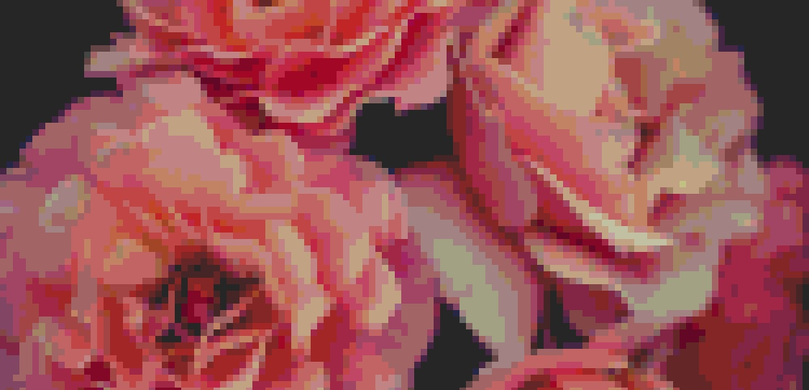

# Pxl

> An image pixelator.

## Installation

You need to install the dependencies for the script. You can do that by running the following command.

```
pip install -r requirements.txt
```

*Note:* Run as `sudo` if that fails (common on MacOS).

## Usage

```
python pxl.py <input-file> <output-file> <pixel-size> <pixelation-method> [method-options]
```

| Argument | Description |
| ------------- |:-------------|
| input file | The image to pixelate. |
| output file | The file to output the image to. |
| pixel size | The size of each pixelated pixel. |
| pixelation method | The [method of pixelation](#pixelation-methods) to use. |

### Pixelation-Methods

```
python pxl.py ... limitBands <color-count>
```

Limit the number of possible band (R,G,B) values to a specific number.

| Argument | Description |
| ------------- |:-------------|
| color count | The number of possible values for each color band (R, G, B). |

```
python pxl.py ... toPalette <palette> [color-match]
```

Get a color from from an existing color palette.

| Argument | Description | Default |
| ------------- |:-------------|:-------------|
| palette | The existing color palette to use. | *Required* |
| color match | The [algorithm](#color-match-algorithms) to use to compare colors. | color |

### Color Match Algorithms

| Algorithm | Description |
| ------------- |:-------------|
| color | Chooses the closest color based on a weighted [euclidean distance](https://en.wikipedia.org/wiki/Color_difference#Euclidean) algorithm. |
| value | Chooses the closest color by finding the smallest difference in values. Best for monochromatic palettes. |

## Demo

### Command

```
py pxl.py ./images/roses.jpg ./images/pixelated-roses.jpg 8 limitBands 8
```

### Input


### Output


